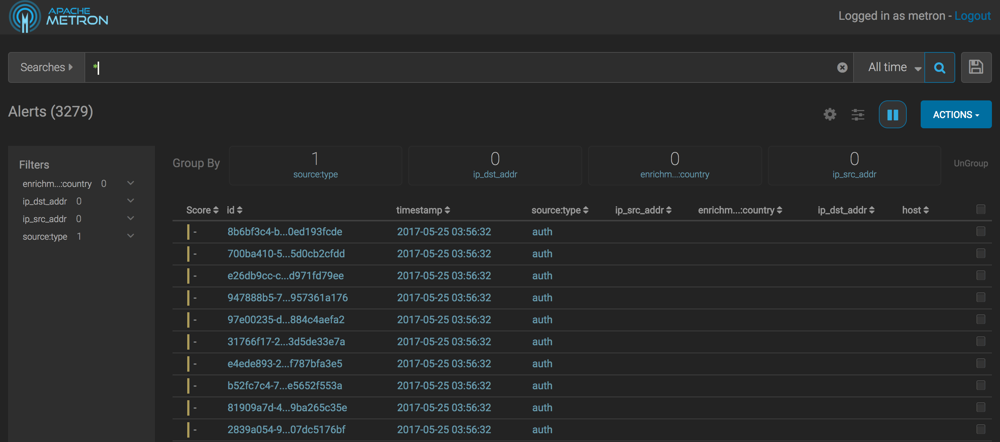
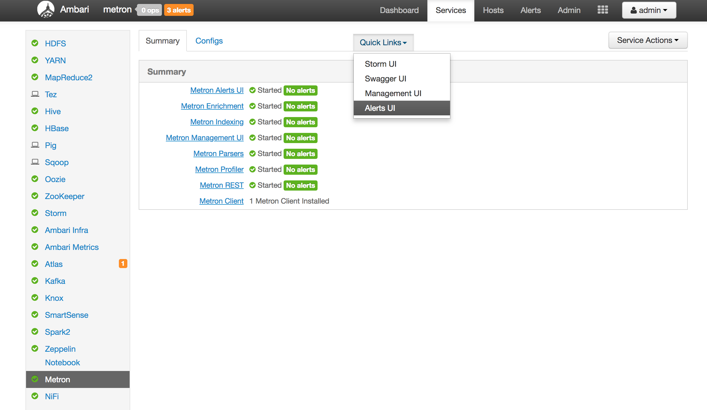



# Getting started with Metron
## Objectives
After this lab you will be able to:
1. Describe the main UIs for Metron.
2. Describe the information contained in each UI.
3. Open the UI and view the content.
## Opening the Metron Management UI

 1. The management UI shows the sensors configured in Metron and their operational state (running/stopped and latency).  From the management UI you can create new sensors, view sensor configuration, browse raw logs sent by the sensor, and change the configuration of sensors.
 2. Open your browser to http://*metron_host_name*:4200/ where *metron_host_name* is the name of the host provided to you in the workshop materials.
 3. When prompted for the password enter metron for the user and metron for the password.  
 
 4. The Metron Management UI opens showing the sensors configured in Metron and their operational state (running/stopped and latency).
   
   
## Opening the Metron Alerts UI
 1. The Metron Alerts UI shows enriched and triaged events stored in the Metron index.  From the Alerts UI, you can filter events, view event fields, and sort events.  You can also escalate, add comments to, or group events. 
 6. Open your browser to http://*metron_host_name*:4201/ where *metron_host_name* is the name of the host provided to you in the workshop materials.
 7. When prompted for the password enter metron for the user and metron for the password.  
 
 8. The Metron Alerts UI opens listing the events reported to Metron.  From the alerts UI you can search, filter and view the details of alerts. 
   
9. Consult the [Viewing Alerts User Guide](https://docs.hortonworks.com/HDPDocuments/HCP1/HCP-1.5.0/bk_user-guide/content/displaying_alerts.html) for more information on how to use the Alerts UI.
## Opening the Ambari UI
 1. Open Ambari to view the status of the Metron infrastructure and start, stop, and restart services.  Ambari also configures, installs and upgrades Metron software.
 2. Open your browser to http://*metron_host_name*:8080/ where *metron_host_name* is the name of the host provided to you in the workshop materials.
 3. When prompted for the password enter admin for the user and admin for the password.
 4. The Ambari management pages open.
   
5. The Quicklinks Ambari menu item launches the UIs for a service.   For example, select the M Management UI and Alerts UI  by selecting Services from the upper right and then Metron from the left.  Pull down quick links and select Management UI or Alerts UI to launch the Metron UIs.

## Single Node Metron Instance Quick Reference
For the workshop you will be provided with a single node version Metron installation.  

|Credential| Value |
|--|--|
|Metron Host Name  | Provided to you  |
|Metron Management UI|http://*metron_host_name*:4200|
|Metron Alerts UI|http://*metron_host_name*:4201|
|Metron Mgmt/Alerts Credentials|metron:metron|
|Ambari URL|http://*metron_host name*:8080|
|Ambari credentials|admin:admin|
|SSH key| Provided to you|
|Ssh| ssh -i *ssh_key.pem* centos@*metron_host_name*
|mysql console|mysql -u *user_name* -p|
|mysqldb root|root:|
|mysqldb metron|metron:Myp@ssw0rd |
|mysqldb metron password|Myp@ssw0rd|
|zoomdata url|http://*metron_host_name*:6430|
|zoomdata credentials|admin:Metron1234!|

## Next Lab
[Parsing squid logs.](..\02_ParsingSquid\README.md)
