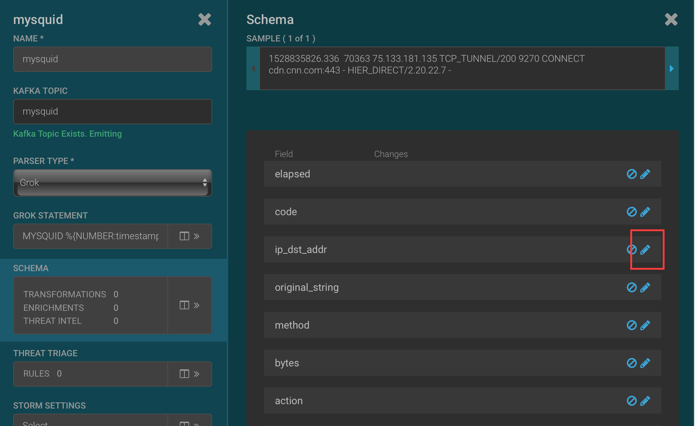
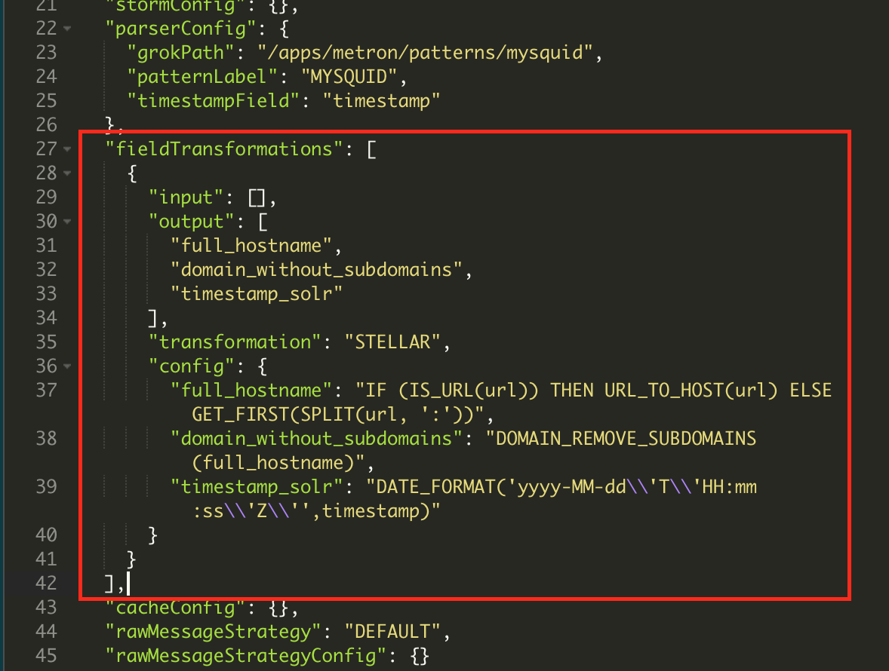

# Enriching Squid logs
## Objectives
After this lab you will be able to:
 1. Enrich an event with the geo location of ip addresses accessed through the squid proxy. 
 2. Enrich an event with field transformations.
## Adding a geocode enrichment
The geo enrichment applied to an ip address instructs Metron to find the physical location of an ip address and add the location as enrichments to the event.  The ip locations can be used in triaging, hunting, map visualizations, and other analytics. 
1. Open the Metron Configuration UI.
2. Click on the pencil icon to the right of the mysquid sensor to change the sensor configuration.  The mysquid configuration opens.


3. Click on the >> icon to the right of the Schema section.


4. Click the pencil icon to the right of the ip_dst_addr field.



5. Select geo from the Enrichments drop down.   


6. Click Save.
7. Scroll to the bottom of the screen and click Save.
8. Configure your proxy to send web requests to the metron proxy or use curl.  Open google.com 
9. Open the Metron Alerts UI.  The events will now have geo locations on their destination ip addresses.
10. Click between the columns to open the event detail.   The components of the geo enrichments begin with enrichments.geo.ip_dst_addr if using Solr or enrichments:geo:ip_dst_addr if using Elastic Search indices.   The geocoding includes the following attributes for each known ip address: city, country, latitude, longitude, postal code, DMA code, location ID, and location point. 


## Adding field transformations
Field transformations add new fields to the event that are derived from existing fields.   Transformations prepare data for triaging, applying machine learning models or further analytics in the     
1. Open the Metron Configuration UI.
2. Click the pencil icon to the right of the mysquid sensor to change the sensor configuration.  The mysquid configuration opens.


3. Metron configuration files are in json format.   Simple transformations can be added in the Configuration UI but our example requires more complex transformations.   Transformations are written in a domain specific language called [Stellar](https://docs.hortonworks.com/HDPDocuments/HCP1/HCP-1.6.1/stellar-quick-ref/content/introduction_to_stellar_language.html).

Click the >> icon to the right of Raw Json in the Advanced section. 


4. On the right side, in the Sensor Parser Config, replace the text:
```
"fieldTransformations": [],
```
with the following text:
```
"fieldTransformations": [
		{
			"input": [],
			"output": [
				"full_hostname",
				"domain_without_subdomains",
				"timestamp_solr"
			],
			"transformation": "STELLAR",
			"config": {
				"full_hostname": "IF (IS_URL(url)) THEN URL_TO_HOST(url) ELSE GET_FIRST(SPLIT(url, ':'))",
				"domain_without_subdomains": "DOMAIN_REMOVE_SUBDOMAINS(full_hostname)",
				"timestamp_solr": "DATE_FORMAT('yyyy-MM-dd\\'T\\'HH:mm:ss\\'Z\\'',timestamp)"
			}
		}
	],
```



5. Click Save under the raw json editors. 
6. Click Save on the lower left of the Sensor configuration file.
7. Generate more squid log entries.
8. Open the Metron Alerts UI.  The latest squid events will have new fields called full_hostname and domain_without_subdomains.  The fields are derived from the url extracted from the original log entry. 


9.  Congratulations!   You have enriched events!  The next step is to triage the events.

## Next Lab
[Triaging squid events.](../04_TriagingSquid/README.md)

## References

[Stellar Quick Reference](https://docs.hortonworks.com/HDPDocuments/HCP1/HCP-1.6.1/stellar-quick-ref/content/introduction_to_stellar_language.html)

